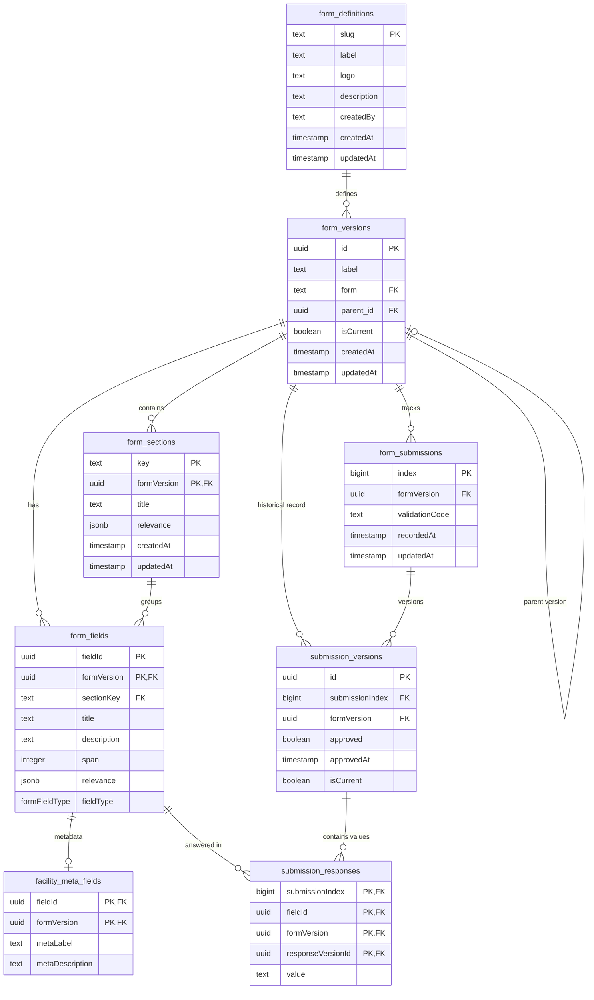

# Forms Documentation

Forms permit users to update existing survey data, import new data as well as perform deletions and revisions.

Users are also permitted to define/import form structure from different sources.

* **xlsf** - Import form structures exported from external tools (e.g. KoboToolbox, etc) in **XLSF format**.

## Database Structure Overview

### Referential Integrity & Cascades

| Table | Dependency (FK) | On Delete | Description |
| --- | --- | --- | --- |
| **form_versions** | `form` | `CASCADE` | Versions are deleted if the parent definition is removed. |
| **form_versions** | `parent_id` | `SET NULL` | Preserves history if the immediate parent version is deleted. |
| **form_sections** | `formVersion` | `CASCADE` | Deleting a version removes its UI structure. |
| **form_fields** | `sectionKey` | `CASCADE` | Fields are cleaned up if their section is deleted. |
| **form_submissions** | `formVersion` | `CASCADE` | Deleting a version wipes all associated data entries. |
| **submission_versions** | `index` | `CASCADE` | Removing a submission wipes all historical revisions. |
| **submission_responses** | `responseVersionId` | `CASCADE` | Responses are purged when their specific version is deleted. |
